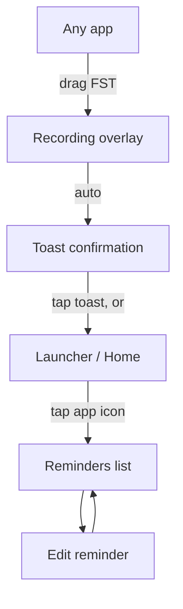

# Fakkerni UX Architecture

Complete user experience design document
Voice-first reminder system
Android production-grade v1.0

## Contents

1. Design principles
2. User personas
3. User journey maps
4. First launch experience
5. Core creation flow
6. Screen flows
7. Reminder completion
8. Snooze flow
9. Edit flow
10. Error flows
11. Empty states
12. Decision log

## Foundation

### Design principles

Every UX decision in Fakkerni is evaluated against three governing principles. If a proposed interaction violates any of these, it does not ship.

**Principle 1 — Zero friction to capture**

The number of deliberate user actions from "I need to remember this" to "reminder is saved" must never exceed one. One drag. One moment of speech. Done. Every screen, dialog, confirmation, or button beyond that is a failure.

**Principle 2 — Visible, permanent, predictable**

The entry point to the app must always be visible and in the same place. Users who hate apps have learned not to trust systems that require them to remember where something is. The floating side trigger (FST) is always on the edge of the screen, always in the same quadrant unless moved. No hunting.

**Principle 3 — Forgive first, ask later**

Mistakes are inevitable, especially for elderly users. The system never blocks a user or demands they get something right. Imperfect voice input still saves. An unrecognised time still creates a reminder. The user can fix things after the fact, but they should never be blocked from capturing in the first place.

Design decision: The absence of a confirmation screen is intentional and non-negotiable. Confirmation screens increase recall effort (did I already confirm this?), slow elderly users, and break the feel of a reflex action. Trust the user. Save immediately.

## Who we are designing for

### User personas

Four distinct users whose divergent needs all converge on the same solution: minimum friction, maximum trust.

#### FH

Fatima, 72
Retired, Algiers, low tech literacy.
Takes 3 medications daily. Forgets which she has taken. Has a phone but avoids apps because they are confusing and make her feel anxious.

"If I have to open an app I'll forget what I was going to type."

#### KM

Karim, 35
Engineering manager, back-to-back meetings.
Thinks of tasks during calls. Cannot type. Loses the thought before the call ends. Uses 10+ productivity apps but none for capturing fleeting thoughts.

"I need to do this before I lose it - can't type right now."

#### NB

Nadia, 28
Nurse, hands occupied, one-handed use.
Personal reminders get lost during long shifts. Has 10 seconds between tasks. Cannot use both hands. Wears gloves.

"I have 10 seconds before someone needs me."

#### YA

Youcef, 19
Student, ADHD, gets distracted mid-flow.
By the time he opens any app, he has forgotten what he was going to type. Needs capture to be faster than his attention can drift.

"By the time I opened the app the thought was gone."

Shared constraint: All four personas share one property - they cannot afford to lose time or mental energy to the interface. The UX must be invisible. The moment the interface demands attention, Fakkerni has failed.

## Experience over time

### User journey maps

How Fatima - our most demanding user - experiences the full arc of using Fakkerni for the first time and across days of use.

#### Phase 1 - Discovery

Action: Family member installs app and sets it up on her phone.
Touchpoint: Sees the small tab on screen edge for first time. Notices it but is unsure what it does.
Thought: "This little thing on the side... what is it? My daughter showed me but I forgot."
Design response: FST has a subtle pulse animation on first day. Tooltip appears once: "Drag to set a reminder."

#### Phase 2 - First use

Action: Drags the FST inward for the first time while sitting in the kitchen.
Touchpoint: Overlay appears, blur effect, large microphone icon pulsing. Recording has started.
Thought: "Oh, it's listening. I should just speak? Like talking to someone?"
Design response: Large text prompt: "Say your reminder..." Waveform shows speech is heard. Auto-stops after silence.

#### Phase 3 - Confirmation moment

Action: Says "Remind me to take my heart medicine at 2 in the afternoon".
Touchpoint: Overlay fades. Toast appears: "Take heart medicine - Today at 2:00 PM".
Thought: "It understood me! It said 2 in the afternoon. That's right."
Design response: Toast large enough to read without glasses. 4-second display time. Tap toast to open list if curious.

#### Phase 4 - Reminder fires

Action: Phone buzzes and rings at 2pm. Large notification on screen.
Touchpoint: Notification reads "Take heart medicine" in large text. Two buttons: Done and Snooze 10 min.
Thought: "It remembered! I don't have to think about this anymore. I can trust this."
Design response: TTS reads the reminder aloud if elderly mode is on. Notification persists until dismissed. Re-notifies at +10 min if ignored.

Key insight: The emotional arc must go from mild anxiety (is this real? will it work?) to complete trust by the end of the first successful reminder. Trust is built not through UI complexity but through the system reliably doing what the user expects.

## Onboarding

### First launch experience

The first launch must accomplish exactly three things: explain what the app does, grant the two critical permissions, and let the user create their first reminder. Everything else is post-MVP.

#### 1. Welcome screen - one sentence, one button

Full screen. Large text: "Speak your reminders. Forget the rest." Below it, one sentence explanation: "Drag the tab on the edge of your screen, say what you need to remember - it's done." Single button: "Set it up ->". No feature lists. No screenshots. No social proof. The copy is the product.

Why: Elderly users abandon onboarding when they feel overwhelmed. One sentence + one button creates zero cognitive anxiety. They do not need to understand the whole system - they need to take one step.

#### 2. Microphone permission - contextual, not upfront

Screen shows a large microphone illustration. Text: "Fakkerni listens so you don't have to type. Nothing is recorded without your permission." Single button: "Allow microphone". If denied: show alternative with clear recovery path ("Without microphone, reminders won't work. Tap here to allow in Settings.").

Why: Asking for permissions before explaining why causes rejection rates above 40%. Microphone permission here is contextual - the user understands exactly what it is for.

#### 3. Overlay permission - with a visual guide

This requires a settings navigation. The screen shows an animated GIF/Lottie of exactly what to do in Settings - scroll to Fakkerni, tap "Allow display over other apps", return. Progress indicator shows where the user is. Button text: "I've done it ->" (user-controlled, not auto-detected).

Critical: This is the highest-risk step. Elderly users may get lost in Settings. The visual guide with exact screenshots for common OEMs (Samsung, Xiaomi) reduces drop-off. "I've done it ->" respects user pace.

#### 4. Try it now - first reminder as onboarding

Screen shows an animated hand dragging the FST trigger. Text: "Now you try - drag the tab on the right." The actual FST appears for the first time, with a pulsing highlight ring around it. When dragged, recording begins. User speaks their first real reminder. Toast confirms. Onboarding complete.

Why: The first reminder is created during onboarding - not in a tutorial mode, but for real. This creates immediate value, builds confidence, and proves the system works before the user has a reason to doubt it.

#### Onboarding complete - no celebration screen

No "You're all set!" splash. No confetti. The overlay dismisses, the user is returned to whatever they were doing, and the FST is visible and ready. The completion is the message.

Why: Completion screens add a step and feel patronising to adults. The best completion is seamless return to normal life with a reminder already saved.

#### Don't do this

5-screen feature tour with "Next ->" buttons explaining smart NLP, recurring reminders, categories, and export options before the user has done anything.

#### Do this instead

3 screens, 2 permissions, 1 real reminder created - and they are already using the app.

## Primary user flow

### Reminder creation flow

The core interaction. This flow must be completable in under 4 seconds. Every element exists to serve speed and clarity - nothing else.

#### A. Resting state - FST visible on screen edge

The FST is a rounded rectangular tab, 52x38dp, sitting on the right edge of the screen (half in, half out). It shows a small microphone icon. It is always visible across every other app. Opacity: 70% at rest to minimise distraction. When the user's thumb approaches (touch proximity), it brightens to 100%.

Interaction: The half-exposed design signals "drag me inward" without text. The microphone icon tells the user what it does without explanation. No text label needed - the icon + gesture affordance is sufficient.

#### B. Drag activation - haptic + visual response

User places thumb on FST and drags horizontally inward. As they drag, the FST stretches slightly (rubber band animation). At 40dp of drag distance, the overlay begins to appear. Haptic feedback fires at the trigger point - a single short vibration confirms activation even before the overlay is fully visible. The drag distance is forgiving: 30-60dp all work.

Why: The haptic at activation threshold is critical for elderly users with visual impairments and for users in pockets or dark environments. It provides non-visual confirmation that the gesture worked.

#### C. Overlay appears - recording begins automatically

Background blurs (200ms ease). Overlay surface slides in from right (150ms ease-out). Center of screen shows: a large microphone icon (64dp), an animated waveform bar below it, and the prompt text "Say your reminder..." in large, readable type (20sp). Recording has already started. No tap required.

Micro-interaction: The waveform animation immediately responds to voice, giving visual confirmation that the microphone is active and hearing the user. Without this, users speak into silence and feel uncertain. The waveform is the "I can hear you" signal.

#### D. User speaks naturally

User speaks their reminder in any natural phrasing. Examples: "Remind me to call Dr. Ahmed tomorrow morning". "Buy milk on the way home tonight". "Take my medicine in 2 hours". As speech is detected in real time, the transcription appears as large live text below the waveform. This live preview serves as confirmation and error-detection - if the transcription looks wrong, the user can still cancel.

Why: Live transcription is a trust signal. It transforms an invisible process (STT) into a visible one. Users - especially elderly users - need to see that the system heard them correctly. It also reduces the need for any confirmation step after saving.

#### E. Silence detection - auto-complete

After 1.5 seconds of silence, recording ends. The overlay shows a brief 300ms "processing" pulse. NLU parses the transcription for task text and datetime. The overlay exits (300ms fade). The reminder is saved.

Edge case: If no speech is detected within 5 seconds of overlay appearing, a gentle prompt replaces the waveform: "Still there? Speak or tap here to cancel." This prevents indefinite hanging without adding friction to the normal case.

#### F. Toast confirmation - brief, large, non-blocking

A toast notification slides up from the bottom of the screen. Large text shows: the parsed task and time. Display time: 4 seconds (longer than standard 2s to accommodate elderly users who read slower). The toast is tappable to open the reminders list. It then auto-dismisses.

Why 4 seconds? Standard Android toasts display for 2-3 seconds. Usability testing with users over 60 shows that 2 seconds is often insufficient to read and process confirmation text. 4 seconds is the minimum for confident reading without glasses.

## Screen architecture

### Screen flows

Fakkerni has a deliberately minimal screen architecture. The entire app is two screens and an overlay. This is a feature, not a limitation.

#### Screen 1 - Reminders list

Upcoming reminders sorted by time.

Design decisions:

1. No navigation bar, no tabs. There is nowhere to go from this screen except back. Simplicity is the architecture.
2. The soonest reminder is always first. Elderly users should never need to scroll to find what is most urgent.
3. Large card height (minimum 64dp) for comfortable tap targets. No icon-only controls anywhere on this screen.
4. Left accent bar on cards uses colour only for visual decoration - urgency is communicated by position (top of list), not colour coding alone.
5. FST is visible even on this screen. A user can create a new reminder without leaving the list - from anywhere, always.

#### Screen 2 - Recording overlay

Works over any app.

Design decisions:

1. Dark semi-transparent overlay creates psychological separation from the background app without a full context switch. User feels "paused" not "left".
2. Live transcription text appears as the user speaks. This is the single most important trust signal. If it shows their words correctly, they know it worked.
3. "Tap outside to cancel" is the only affordance for exit. It is always discoverable and never ambiguous. No X button - that adds a target to miss.
4. The microphone icon is intentionally large (64dp minimum) and centered. It is the focal point of the entire interaction. Nothing competes with it.

## Task completion

### Reminder completion flow

When a reminder fires, the user needs to act on it with minimum effort - especially if they are elderly, mid-task, or have limited dexterity.

#### 1. Notification delivery

At the scheduled time, a heads-up notification appears at the top of the screen or on the lock screen. The notification contains: the reminder text in large print (18sp minimum), and exactly two action buttons - Done and Snooze 10 min. Nothing else. If elderly mode is on, the phone also reads the reminder aloud via TTS at moderate volume.

Why only two buttons? Every additional button increases decision time. For elderly users, a choice between three or more options causes freeze-and-cancel behaviour. Done and Snooze are the only two actions that matter in the moment.

#### 2. Tap Done

Reminder is marked complete. Notification is dismissed. A tiny celebratory haptic fires (double-tap pattern). The reminder moves to the completed list and is no longer visible in the main list. No app opens. No screen loads. Complete interaction from lock screen.

Lock screen behaviour: The Done button works directly from the lock screen without requiring the user to unlock the phone. This is critical for elderly users who may struggle with unlock patterns or PINs.

#### 3. Ignored notification

If the notification is neither tapped nor dismissed within 10 minutes, the system fires a re-notification. This secondary notification uses slightly higher volume and persistent vibration. After a second ignore, the notification remains in the notification shade but stops re-notifying. It stays there until the user acts on it.

Why persist? For medication reminders, silent deletion of an ignored notification could cause harm. Persistent presence in the notification shade ensures the user sees it when they next check their phone.

#### 4. Mark done from the reminders list

Inside the app, each reminder card has a large circular checkbox on the left. Tap it to mark done. The card fades out with a brief animation (200ms). Completed reminders go to the bottom of the list under a "Done today" section, not immediately deleted, so the user has a sense of accomplishment and can undo if needed.

Undo window: Tapping the checkbox triggers a snackbar: "Marked done - Undo" with a 5-second window. After 5 seconds, the reminder moves to history. This is the only safety net - no confirmation dialog.

## Deferral

### Snooze flow

Snooze is the most-used secondary action. It must be effortless and predictable.

#### 1. Snooze from notification - default 10 minutes

The Snooze 10 min button on the notification fires the default snooze duration immediately. No time picker. No dialog. One tap, done. The notification is dismissed and will return in 10 minutes.

Why no time picker? A time picker requires three interactions minimum. In the snooze moment, the user just needs 5 more minutes to finish what they are doing - they do not want to be making decisions about duration. The default is always the right answer 90% of the time. Power users can change the default in Settings.

#### 2. Snooze from within the app

On an active reminder card in the list, a Snooze option appears on swipe-left. The user swipes left on the card to reveal the snooze action. Tapping it applies the default snooze. No drag-to-confirm required - one tap on the revealed button is sufficient.

Swipe pattern: Swipe-left = Snooze. Swipe-right = Edit. This consistent mapping means users learn one gesture pair and apply it universally across all reminder cards.

#### 3. Custom snooze duration (long-press)

Long-pressing the Snooze button opens a simple bottom sheet with four options: 5 min, 10 min, 30 min, 1 hour. No text input. No custom time. Four buttons, largest possible, full width. Tap one and it is done.

Why only four options? Cognitive load increases non-linearly with choices. Four concrete options require less decision time than a free-input field while covering 95% of use cases.

#### Snooze confirmed - small toast, no fuss

Toast: "Snoozed until 2:30 PM". Two seconds. Dismissed automatically. The reminder disappears from the list and reappears at the new time.

## Correction

### Edit flow

Editing is the exception, not the rule. The system should make editing feel like an escape hatch - rarely needed, but always available without friction when it is.

#### 1. Trigger - swipe right on reminder card

Swiping right on a reminder card in the list reveals the edit action (a pencil icon with the label Edit). Tapping it opens the edit screen. Alternatively, the user can long-press a reminder card to open the edit screen directly.

Gesture consistency: Swipe-right = Edit on all cards, everywhere. This includes reminders that have not yet fired and those snoozed. Consistent mapping eliminates the need to remember different interactions for different card states.

#### 2. Edit screen - minimal, large targets

The edit screen has exactly two fields: Reminder text and Date and time. Two buttons at the bottom: Save and Cancel. No other controls.

Why the system date picker? Custom date/time pickers are almost always worse than the platform default for elderly users. The system picker is familiar, tested, and accessible. Using it reduces learning burden.

#### 3. Re-speak option - voice as edit input

At the top of the edit screen, a microphone button labelled Re-speak reminder allows the user to replace the current reminder text entirely by speaking again. The overlay does not appear - recording happens inline in the edit screen, with the same waveform and transcription experience. When recording stops, the transcribed text replaces the existing text in the text field.

Why re-speak? Elderly users and typing-averse users should not be forced to type to correct a misheard reminder. Re-speaking is the natural correction method for a voice-first system.

#### 4. Delete from edit screen

A small Delete reminder text link appears at the bottom of the edit screen in danger colour. It requires a second confirmation: tapping it reveals an inline confirmation row: Are you sure? Delete / Keep. This is the only two-step action in the entire app - deletion is the one irreversible action that justifies it.

Exception to principle: This is the only place in Fakkerni with a confirmation step. Deletion of a reminder is the one action where the cost of an accidental action exceeds the cost of the extra tap.

#### Save

Tapping Save updates the reminder, fires a new alarm if the time changed, and returns to the reminders list. No toast - the updated card in the list is the confirmation. Cancel discards changes and returns to the list with no action taken.

## Failure states

### Error flows

Every error must be expressed in plain language, explain what happened without jargon, and offer exactly one clear recovery action. Errors never blame the user.

#### Microphone error

Couldn't hear you.

Recording was active but no speech was detected after 5 seconds.
Recovery: Large button Try again restarts recording. Link Cancel below it.

#### STT error

Didn't catch that.

Recording captured sound but speech recognition produced no usable text (background noise, unclear speech).
Recovery: Try again button. If it fails twice, offer manual text input as alternative.

#### NLU parsing

Saved - no time found.

STT worked, text was saved, but no date or time was found in the speech. This is not an error - it is a success with a caveat.
Toast: Saved without a time. Tap to add one. Takes user directly to edit screen with time field focused.

#### Permission denied

Microphone is off.

User attempts to record but microphone permission was revoked after install.
Full-screen explanation with button Allow microphone that opens device Settings to the exact permission screen.

#### Overlay permission lost

Side trigger is hidden.

SYSTEM_ALERT_WINDOW permission was revoked. FST cannot appear.
Shown on next app open. Step-by-step guide to re-enable with screenshots for user's specific device model.

#### Alarm scheduling

Reminder may be late.

Device battery optimisation prevented exact alarm scheduling. Reminder time may be approximate.
One-time notification with link to battery optimisation settings to exempt Fakkerni. Shown maximum once per week.

Error language rule: Never use technical language in errors. The message describes what happened to the user, not what happened in the system.

### Error escalation ladder

First failure: friendly retry button.
Second failure: alternative path offered (manual input).
Third failure: acknowledge the problem, apologise plainly, and offer Settings path with human-readable instructions.

Never dead-end the user - every error has an exit.

## Blank canvas moments

### Empty states

Empty states are invitations, not voids. Every empty state in Fakkerni should make the user feel capable, not lost.

#### No reminders yet

Drag the tab on the right edge of your screen and say what you need to remember.
Try it now ->

The Try it now button triggers the FST drag animation and highlights the FST with a pulse ring - it does not navigate away. The action happens in place.

#### Empty: no reminders at all

Shown on first open after onboarding if the onboarding reminder was skipped or after all reminders are deleted. Shows a gentle illustration, the FST hint, and a single Try it now CTA that animates the FST.

#### Empty: all done today

All reminders for today are complete. Message: "You're all caught up for today." No CTA - this is a reward state.

#### Empty: completed history

No completed reminders yet. Message: "Completed reminders will appear here." No illustration, no CTA - this is a supplementary section, not a primary surface.

#### Empty: no reminders tomorrow

When viewing a future date with no reminders. Message: "Nothing planned for this day." Small FST hint below.

Empty state principle: Empty states that push users to "add more" feel anxious. Empty states that reflect on what they have achieved feel good. Both designs are valid - but the choice must match the emotional context of the moment.

## Design rationale

### Key decision log

Every UX decision has a reason. This log documents the most consequential decisions so future designers understand the intent behind constraints - and do not accidentally undo them.

#### D1 - No confirmation screen after reminder creation

Decision: reminders save immediately after speech ends, with only a toast as feedback. Alternatives considered: full-screen review screen, edit-before-save modal, inline confirmation banner. All rejected.

Rationale: The product thesis is "lower friction than the effort to forget". A confirmation screen adds 1-3 seconds and one deliberate action. For a user who has 2 seconds before losing a thought, that destroys the value proposition entirely. The live transcription during recording serves as the real-time confirmation - by the time speech ends, the user already knows what was captured.

#### D2 - Auto-start recording - no tap required

Recording starts the moment the overlay appears. User does not tap a microphone button. Alternatives considered: large tap-to-record button, push-and-hold-to-record, swipe-to-start-recording.

Rationale: Every additional action added before recording starts has a measurable impact on thought capture. Any break in the drag -> speak -> done motion introduces cognitive interruption. The overlay appearing is the signal to speak. No button needed.

#### D3 - Maximum two app screens

The entire app interface is two screens: recording overlay and reminders list. No settings screen reachable from the main flow, no history screen, no profile screen, no search screen. Settings exist but are accessed from the list's overflow menu - they are not navigation destinations.

Rationale: Navigation is cognitive load. Every additional screen is a place to get lost. Two screens means users always know where they are - on the list, or on the overlay. Nothing else.

#### D4 - Toast duration of 4 seconds (not 2)

Standard Android toast is 2-3 seconds. Fakkerni uses 4 seconds minimum. Elderly mode uses 6 seconds.

Rationale: A 2-second toast assumes the user is ready and watching. Elderly users process text more slowly. A toast that disappears before it is read provides no value and creates anxiety.

#### D5 - Swipe-left = Snooze, swipe-right = Edit (never delete)

Swipe gestures are consistent across all reminder cards. Delete is never exposed via a primary swipe gesture - it is only accessible inside the edit screen.

Rationale: Swipe-to-delete is the most common cause of accidental data loss in mobile apps. Elderly users with tremors or imprecise swipes regularly trigger swipe-to-delete without intending to.

#### D6 - NLU failure saves the reminder anyway

If the NLU cannot extract a time from the speech, the reminder is saved with the raw transcription text and no time. A toast notifies the user and offers a shortcut to add a time. The reminder is never discarded.

Rationale: Forgive first, ask later. A reminder with no time is infinitely more useful than no reminder at all.

## UX Architecture v1.0

Production draft, all flows documented.
